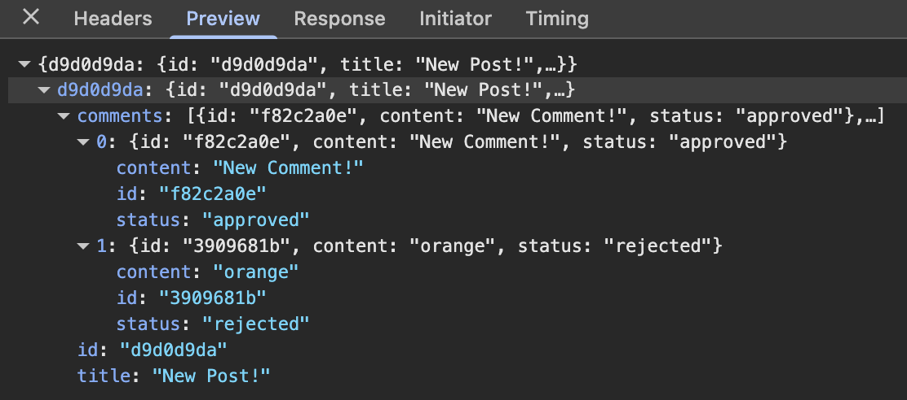

# mini-microservices-app

## Description

A mini microservices app using React, Express, and NodeJS.

The application enables the user to create posts and add comments to posts. It displays user-created data ("read" functionality in CRUD terms), and it moderates comments with a "pending," "approved," or "rejected" status based on an arbitrary flagged word (e.g. "orange"). An event bus communicates between the different layers of the app to prevent direct interdependence between services.

## Usage

Data are stored in memory (not in a database) and so won't persist across sessions. To run the program locally, spin up servers from the posts, comments, query, moderation, event-bus, and client directories with the command _npm start_. Refresh the page in the browser to see the UI update once a change is made. Comment moderation is not reflected in the UI, so I provided in the Preview section below a screenshot of what's going on under the hood in the Network tab of Google Chrome's Developer Tools.

## Learning Objectives Attained

- To gain a better conceptual and practical understanding of the advantages and complexities of microservices architecture.
- To build an application with microservices for two resources--posts and comments--then adding a query service and a comment moderation service.
- To build the architecture with an informed understanding of the tradeoffs of synchronous and asynchronous communication between services.
- To implement a basic event bus from scratch, which handles the emitting and processing of different events across microservices without introducing any direct dependencies.
- To gain experience handling updates to resources via communication with the event bus.

## Secondary Technologies & Techniques

Axios, Nodemon, CORS (errors handling), Express route handling, JSON parsing, Random Bytes (for generating random ids), React Hooks, Bootstrap (for rapid prototyping), Diagrams.net (for visualizing microservices architecture and communication between services), zsh (command line), Google Chrome Developer Tools Network tab monitoring for GET and POST requests while testing services

## Preview

Screenshot of Network tab to show comment moderation service in action. Notice that the status of a given comment.

## Course Attribution

This learning project was instructed by Stephen Grider in his course [Microservices with NodeJS and React](https://www.udemy.com/course/microservices-with-node-js-and-react/?couponCode=CP251118BG1).
